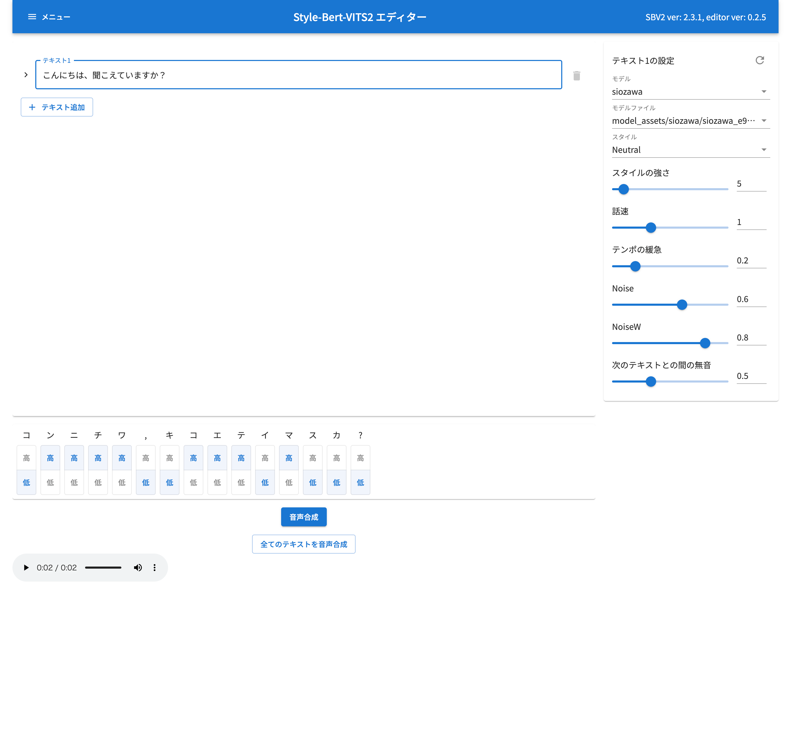

# ai-retaker

## 使い方
ai-retakerは下記のOSSの合成音声のモデルで音声合成を行います。

- [Style-Bert-VITS2](https://github.com/litagin02/Style-Bert-VITS2)
- [GPT-SoVITS](https://github.com/RVC-Boss/GPT-SoVITS)


### Style-Bert-VITS2のセットアップ

#### インストール
公式のREADMEを参考にStyle-Bert-VITS2のインストールを行います。  
[公式 README](https://github.com/litagin02/Style-Bert-VITS2)

#### モデルの配置
インストールが完了したら、Style-Bert-Vits2のディレクトリのmodel_assetsに、以下の手順でモデルをダウンロードして配置してください。
1. [tinjyuu/style-bert-vits2-siozawa](https://huggingface.co/tinjyuu/style-bert-vits2-siozawa/tree/main) のリポジトリにアクセスします。
2. リポジトリのページにアクセスし、siowazaディレクトリを選択します。
3. siowazaディレクトリ内のすべてのファイルを選択し、ダウンロードします。
4. ダウンロードしたsiowazaディレクトリを、Style-Bert-Vits2のディレクトリ内のmodel_assetsディレクトリに配置します。
以上の手順により、必要なモデルファイルがStyle-Bert-Vits2/model_assets/siowazaに配置されます。モデルの配置が完了したら、音声合成を実行する準備が整います。

```
Style-Bert-Vits2/
│
├── model_assets/
│   └── siowaza/
└── README.md
```

#### 音声合成
Style-Bert-VITS2のディレクトリのEditor.batをダブルクリックか、python server_editor.py --inbrowserを実行して音声合成のエディタを起動します。

起動したら、先程配置したモデルを選択し、テキスト欄に好きなテキストを入力して音声合成を行います。
文字を入力すると自動的に音声合成が行われ、音声が再生されます。




## デモ

サンプルボイス

<audio controls>
  <source src="voice/45745a58-67a0-456b-8ab1-1d3b02ce0a0e.wav" type="audio/wav">
  お使いのブラウザはオーディオタグをサポートしていません。
</audio>


バーチャルイケメン

<video width="320" height="240" controls>
  <source src="movies/demo1.mp4" type="video/mp4">
  お使いのブラウザはビデオタグをサポートしていません。
</video>

バーチャル美女

<video width="320" height="240" controls>
  <source src="movies/demo2.mp4" type="video/mp4">
  お使いのブラウザはビデオタグをサポートしていません。
</video>
